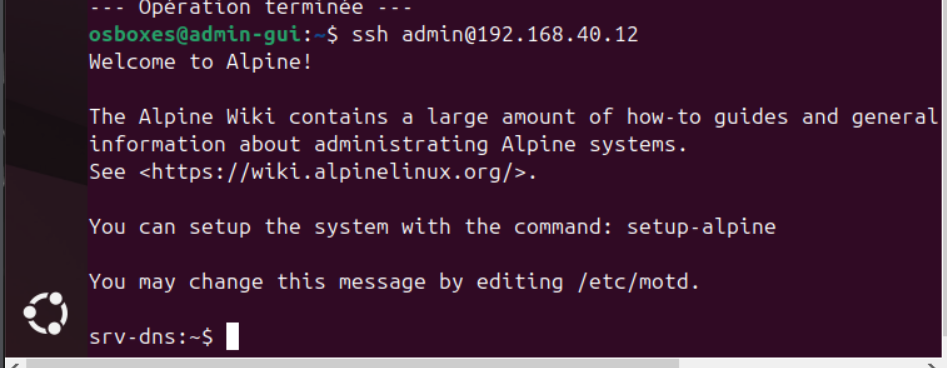

# 🖥️ Déploiement des machines — Lab GNS3

> Configuration des VMs, adressage statique/DHCP, accès SSH et création des comptes administrateurs.


---

## 📋 Table des matières

- [Inventaire des machines](#-inventaire-des-machines)
- [Adressage des machines](#-adressage-des-machines)
- [Configuration SSH & compte admin](#-configuration-ssh--compte-admin)

---

## 📦 Inventaire des machines

| Hostname | OS | Rôle | Adresse IP | VLAN |
|---|---|---|---|---|
| user1 | Alpine Linux | Utilisateur | DHCP | VLAN 10 — Users |
| user2 | Alpine Linux | Utilisateur | DHCP | VLAN 10 — Users |
| admin | Alpine Linux | Admin | 192.168.20.10/24 | VLAN 20 — Admin |
| srv-dhcp | Alpine Linux | Serveur DHCP | 192.168.30.10/24 | VLAN 30 — Servers |
| srv-dns | Alpine Linux | Serveur DNS interne | 192.168.40.12/24 | VLAN 40 — DMZ |
| srv-files | Alpine Linux | Partage Samba/NFS/SFTP | 192.168.30.20/24 | VLAN 30 — Servers |
| srv-web | Alpine Linux | Serveur Web (Nginx) | 192.168.40.10/24 | VLAN 40 — DMZ |
| srv-proxy | Alpine Linux | Reverse Proxy | 192.168.40.11/24 | VLAN 40 — DMZ |
| admin-gui | Ubuntu 22.04 | Supervision (Prometheus/Grafana) | 192.168.20.2/24 | VLAN 20 — Admin |
| srv-ldap | Rocky Linux | Annuaire LDAP | 192.168.30.30/24 | VLAN 30 — Servers |

---

## 🌐 Adressage des machines

Pour adresser les machines, connectez-vous à la console et éditez les fichiers de configuration réseau. Des tutoriels dédiés sont disponibles en ligne — voici quelques exemples de configuration pour chaque OS utilisé dans ce lab.

---

### 🐧 Alpine Linux


---

### 🐧 Ubuntu 22.04


---

### 🐧 Rocky Linux


---

## 🔐 Configuration SSH & compte admin

Une fois les machines adressées, on configure SSH et on crée un compte administrateur sur chacune d'elles.

> 💡 Pour la mise à jour des paquets et la préparation initiale des machines, référez-vous au fichier `setup-lab`.

---

### 1. Configuration des hostnames

Commencez par assigner un hostname à chaque machine.

**Alpine Linux**

```sh
echo "srv-dhcp" > /etc/hostname
hostname -F /etc/hostname
```

**Ubuntu & Rocky Linux**

```sh
hostnamectl set-hostname nom-de-la-machine
```

---

### 2. Installation & démarrage de SSH

SSH est à configurer **uniquement sur les machines serveur**.

**Alpine Linux**

```sh
rc-service sshd start
```

**Rocky Linux**

```sh
sudo systemctl enable --now sshd
```

---

### 3. Création du compte admin

Sur chaque serveur, créez l'utilisateur `admin` et définissez son mot de passe :

```sh
sudo adduser admin
sudo passwd admin
```

Ajoutez-le au groupe `wheel` pour lui donner les droits sudo :

**Alpine Linux**

```sh
sudo addgroup admin wheel
```

**Rocky Linux**

```sh
sudo usermod -aG wheel admin
```

Puis éditez le fichier sudoers pour activer les droits du groupe :

```sh
visudo
```

Décommentez la ligne suivante :

```
%wheel ALL=(ALL) ALL
```

---

### 4. Préparation des fichiers SSH

On crée d'abord la structure des fichiers — les clés seront ajoutées à l'étape suivante :

```sh
sudo mkdir -p /home/admin/.ssh
sudo vi /home/admin/.ssh/authorized_keys
```

> Quand l'éditeur s'ouvre, fermez-le simplement (`:wq`).

Ajustez ensuite les permissions :

```sh
sudo chmod 700 /home/admin/.ssh
sudo chmod 600 /home/admin/.ssh/authorized_keys
sudo chown -R admin:admin /home/admin/.ssh
```

---

### 5. Génération des clés SSH (machines clientes)

Depuis les machines `admin` et `admin-gui`, générez une paire de clés :

```sh
ssh-keygen -t ed25519 -C "admin@homelab"
```

---

### 6. Déploiement automatique des clés

Plutôt que de copier manuellement la clé sur chaque serveur, on utilise un script qui s'en charge automatiquement.

**Créez le script `copy_keys.sh` :**

```sh
#!/bin/sh

USER_DISTANT="admin"
FICHIER_IPS="serveurs.txt"

if [ ! -f "$FICHIER_IPS" ]; then
    echo "Erreur : créez un fichier $FICHIER_IPS avec une IP par ligne."
    exit 1
fi

echo "--- Début du déploiement ---"

while read -r IP; do
    [ -z "$IP" ] && continue
    echo ""
    echo ">>>> Installation sur : $IP"
    ssh-copy-id -o StrictHostKeyChecking=no "$USER_DISTANT@$IP"
    if [ $? -eq 0 ]; then
        echo "✅ Succès pour $IP"
    else
        echo "❌ Échec pour $IP"
    fi
done < "$FICHIER_IPS"

echo ""
echo "--- Opération terminée ---"
```

**Créez le fichier `serveurs.txt` avec les IPs de tous vos serveurs :**

```
192.168.30.10
192.168.40.12
192.168.30.20
192.168.40.10
192.168.40.11
192.168.30.30
```

**Rendez le script exécutable et lancez-le :**

```sh
chmod +x copy_keys.sh
./copy_keys.sh
```

> ⚠️ Ces étapes sont à exécuter **sur `admin` et sur `admin-gui`**.

---

### ✅ Résultat

Une fois le déploiement terminé, vous pouvez vous connecter à n'importe quel serveur depuis vos machines d'administration sans mot de passe :



---

Et voilà, cette partie est terminée ! Je suis assez sommaire sur certaines étapes — documenter et réaliser le lab en même temps, c'est un exercice délicat. Je prévois un fichier de debug listant les problèmes courants que vous pourrez rencontrer.

---


Alpine Linux, Ubuntu 22.04 et Rocky Linux.*
