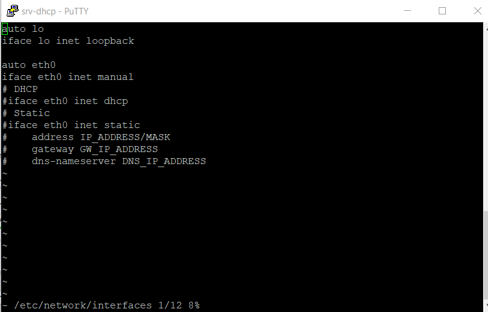
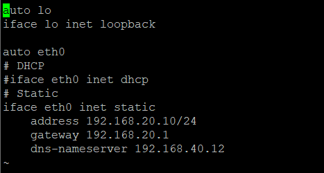
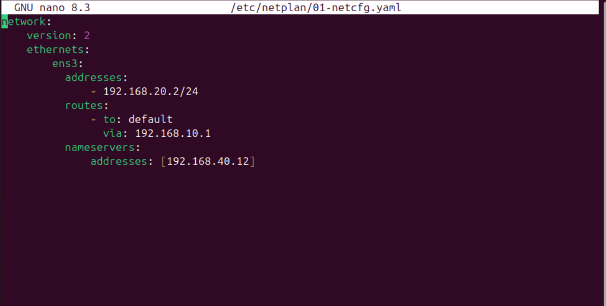
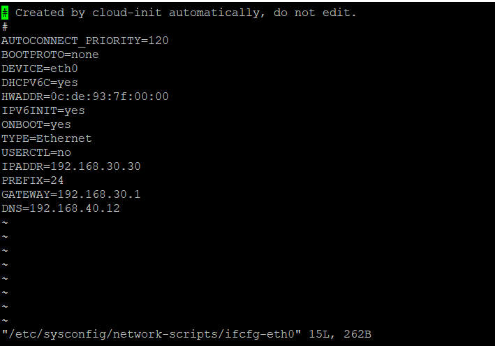

# 🖥️ Déploiement des machines — Lab GNS3

> Configuration des VMs, adressage statique/DHCP, accès SSH et création des comptes administrateurs.


---

## 📋 Table des matières

- [Inventaire des machines](#-inventaire-des-machines)
- [Adressage des machines](#-adressage-des-machines)
- [Configuration SSH & compte admin](#-configuration-ssh--compte-admin)

---

## 📦 Inventaire des machines

| Hostname | OS | Rôle | Adresse IP | VLAN |
|---|---|---|---|---|
| user1 | Alpine Linux | Utilisateur | DHCP | VLAN 10 — Users |
| user2 | Alpine Linux | Utilisateur | DHCP | VLAN 10 — Users |
| admin | Alpine Linux | Admin | 192.168.20.10/24 | VLAN 20 — Admin |
| srv-dhcp | Alpine Linux | Serveur DHCP | 192.168.30.10/24 | VLAN 30 — Servers |
| srv-dns | Alpine Linux | Serveur DNS interne | 192.168.40.12/24 | VLAN 40 — DMZ |
| srv-files | Alpine Linux | Partage Samba/NFS/SFTP | 192.168.30.20/24 | VLAN 30 — Servers |
| srv-web | Alpine Linux | Serveur Web (Nginx) | 192.168.40.10/24 | VLAN 40 — DMZ |
| srv-proxy | Alpine Linux | Reverse Proxy | 192.168.40.11/24 | VLAN 40 — DMZ |
| admin-gui | Ubuntu 22.04 | Supervision (Prometheus/Grafana) | 192.168.20.2/24 | VLAN 20 — Admin |
| srv-ldap | Rocky Linux | Annuaire LDAP | 192.168.30.30/24 | VLAN 30 — Servers |

---

## 🌐 Adressage des machines

Pour adresser les machines, connectez-vous à la console et éditez les fichiers de configuration réseau. Des tutoriels dédiés sont disponibles en ligne — voici quelques exemples de configuration pour chaque OS utilisé dans ce lab.

---

### 🐧 Alpine Linux




---

### 🐧 Ubuntu 22.04



---

### 🐧 Rocky Linux



---

## 🔐 Configuration SSH & compte admin

Une fois les machines adressées, on configure SSH et on crée un compte administrateur sur chacune d'elles.

---

### 🐧 Alpine Linux

#### Installation de SSH

```bash
apk update
apk add openssh
rc-update add sshd default
service sshd start
```


---

*Lab réalisé sur GNS3 — machines Alpine Linux, Ubuntu 22.04 et Rocky Linux.*
