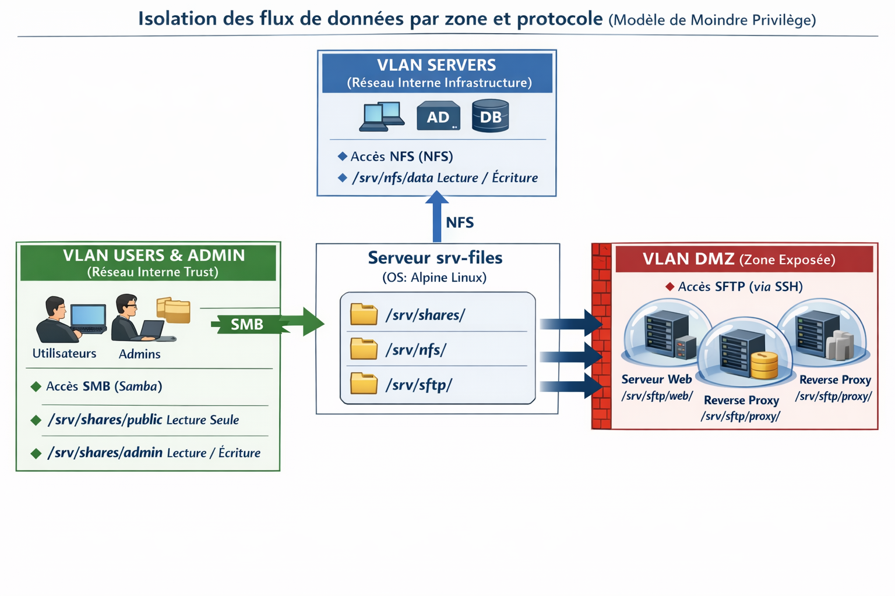

# 📁 Serveur de fichiers — srv-files

> Centralisation, sécurisation et distribution des données via trois services de partage distincts : Samba, NFS et SFTP.

---

## 🏛️ Architecture & philosophie

Cette partie se concentre sur la mise en place de `srv-files`. Son rôle est de centraliser et distribuer les données à travers toute l'infrastructure via trois protocoles de partage complémentaires.

La sécurité ne repose pas sur la confiance, mais sur le **contrôle strict**. Toute la configuration s'articule autour du principe du **Moindre Privilège**.

---

## 🔒 Le principe du Moindre Privilège

> N'accorder que l'accès strictement nécessaire — ni plus, ni moins.

- **Accès sélectif** — un utilisateur n'accède qu'aux ressources utiles à sa mission
- **Droits restreints** — si la lecture suffit, l'écriture est interdite
- **Isolation** — une faille sur un service ne doit pas compromettre les autres

Ce principe est appliqué à travers **trois couches de verrouillage** :

### Par la segmentation réseau (VLAN)

- Le flux **NFS** est réservé au VLAN `SERVERS`
- Le flux **Samba** est réservé aux VLANs `USERS` et `ADMIN`
- Le flux **SFTP** est l'unique porte d'entrée pour la `DMZ`

### Par la configuration des services

- **Samba** — le dossier public est forcé en lecture seule pour les utilisateurs
- **SFTP** — chaque utilisateur est enfermé dans une *Chroot Jail* (prison virtuelle) qui l'empêche de remonter à la racine du serveur

### Par les permissions système Linux

- Utilisation de groupes dédiés (`smb-users`, `smb-admins`)
- Chaque dossier appartient à un propriétaire précis avec des droits `755` ou `770` pour bloquer les accès non autorisés au niveau du disque

---

## 📊 Table des partages

| Partage | Protocole | Chemin local (`/srv/`) | Utilisateurs / Zone | Droits |
|---|---|---|---|---|
| Public | Samba | `/shares/public` | USERS, ADMIN | RO (Users) / RW (Admin) |
| Admin | Samba | `/shares/admin` | ADMIN seulement | RW |
| Srv-Data | NFS | `/nfs/data` | SERVERS seulement | RW |
| Web-DMZ | SFTP | `/sftp/web` | Serveur Web (DMZ) | RW — Chrooté |
| Proxy-DMZ | SFTP | `/sftp/proxy` | Reverse Proxy (DMZ) | RW — Chrooté |
| DNS-DMZ | SFTP | `/sftp/dns-ext` | DNS Externe (DMZ) | RW — Chrooté |

