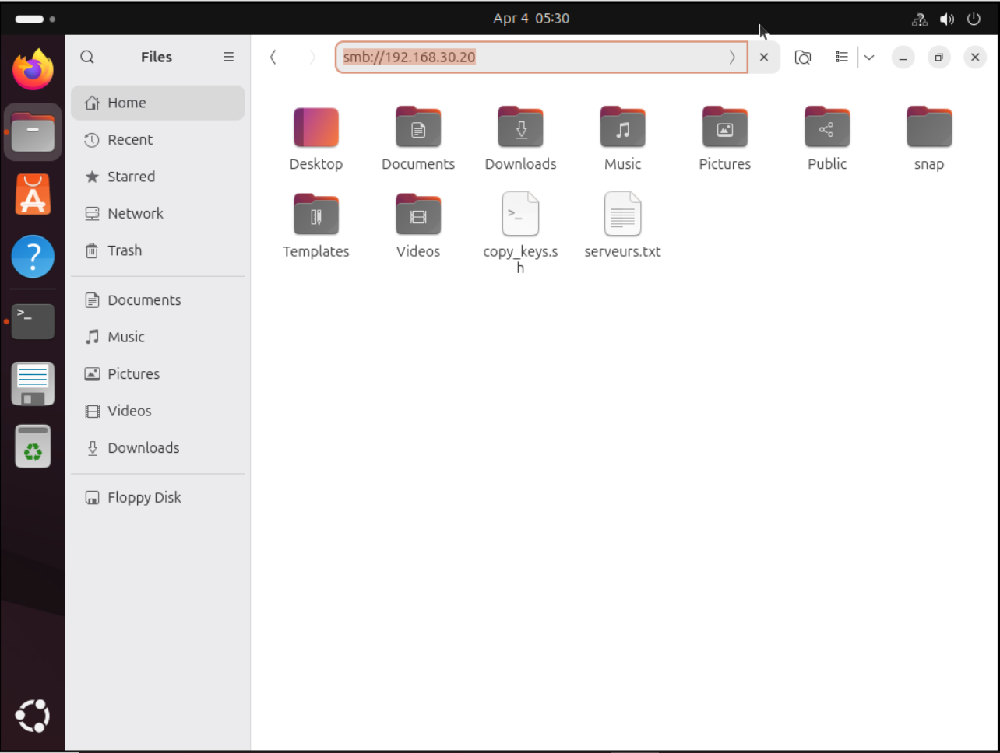
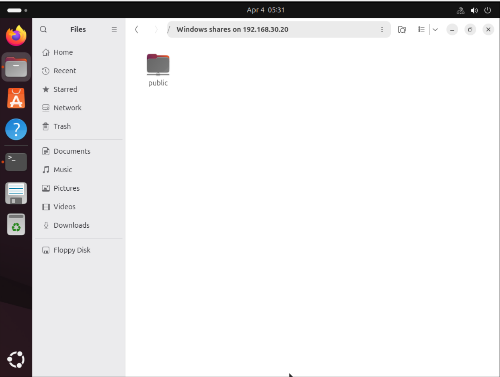
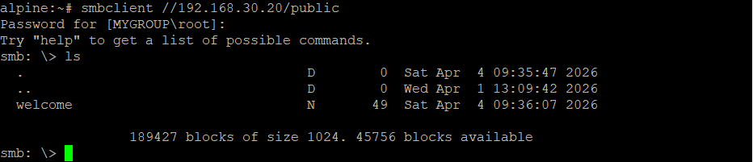
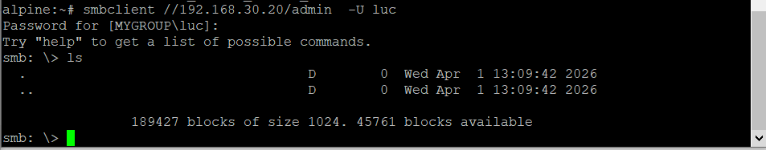
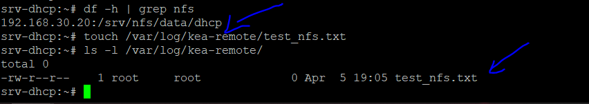

# 📁 Serveur de fichiers — srv-files

> Centralisation, sécurisation et distribution des données via trois services de partage distincts : Samba, NFS et SFTP.


---

## 🏛️ Architecture & philosophie

Cette partie se concentre sur la mise en place de `srv-files`. Son rôle est de centraliser et distribuer les données à travers toute l'infrastructure via trois protocoles de partage complémentaires.

La sécurité ne repose pas sur la confiance, mais sur le **contrôle strict**. Toute la configuration s'articule autour du principe du **Moindre Privilège**.

---

## 🔒 Le principe du Moindre Privilège

> N'accorder que l'accès strictement nécessaire — ni plus, ni moins.

- **Accès sélectif** — un utilisateur n'accède qu'aux ressources utiles à sa mission
- **Droits restreints** — si la lecture suffit, l'écriture est interdite
- **Isolation** — une faille sur un service ne doit pas compromettre les autres

Ce principe est appliqué à travers **trois couches de verrouillage** :

### Par la segmentation réseau (VLAN)

- Le flux **NFS** est réservé au VLAN `SERVERS`
- Le flux **Samba** est réservé aux VLANs `USERS` et `ADMIN`
- Le flux **SFTP** est l'unique porte d'entrée pour la `DMZ`

### Par la configuration des services

- **Samba** — le dossier public est forcé en lecture seule pour les utilisateurs
- **SFTP** — chaque utilisateur est enfermé dans une *Chroot Jail* (prison virtuelle) qui l'empêche de remonter à la racine du serveur

### Par les permissions système Linux

- Utilisation de groupes dédiés (`smb-users`, `smb-admins`)
- Chaque dossier appartient à un propriétaire précis avec des droits `755` ou `770` pour bloquer les accès non autorisés au niveau du disque

---

## 📊 Table des partages

| Partage | Protocole | Chemin local (`/srv/`) | Utilisateurs / Zone | Droits |
|---|---|---|---|---|
| Public | Samba | `/shares/public` | USERS, ADMIN | RO (Users) / RW (Admin) |
| Admin | Samba | `/shares/admin` | ADMIN seulement | RW |
| Srv-Data | NFS | `/nfs/data` | SERVERS seulement | RW |
| Web-DMZ | SFTP | `/sftp/web` | Serveur Web (DMZ) | RW — Chrooté |
| Proxy-DMZ | SFTP | `/sftp/proxy` | Reverse Proxy (DMZ) | RW — Chrooté |
| DNS-DMZ | SFTP | `/sftp/dns-ext` | DNS Externe (DMZ) | RW — Chrooté |


---

## 🗂️ Samba

### 1. Installation
```sh
apk update
apk add samba samba-common-tools
```

### 2. Création des dossiers partagés
```sh
mkdir -p /srv/shares/public
mkdir -p /srv/shares/admin
```

### 3. Création des groupes
```sh
addgroup smb-users
addgroup smb-admins
```

### 4. Attribution des droits
```sh
# Root est propriétaire, les groupes ont l'accès
chown -R root:smb-users /srv/shares/public
chown -R root:smb-admins /srv/shares/admin

# 755 = lecture seule pour le groupe / 770 = accès privé
chmod 755 /srv/shares/public
chmod 770 /srv/shares/admin
```

### 5. Configuration de Samba

Videz le fichier `/etc/samba/smb.conf` et collez la configuration suivante :
```ini
# =================================================================
# CONFIGURATION GLOBALE DU SERVEUR
# =================================================================
[global]
   workgroup = WORKGROUP
   server string = srv-files

   # Force l'authentification par compte utilisateur
   security = user

   # Les utilisateurs inconnus sont traités comme invités
   # Indispensable pour que [public] fonctionne sans mot de passe
   map to guest = Bad User

   log file = /var/log/samba/log.%m
   max log size = 50


# =================================================================
# PARTAGE PUBLIC — LECTURE SEULE POUR TOUS
# =================================================================
[public]
   path = /srv/shares/public
   comment = Partage Public
   browseable = yes
   read only = yes

   # Exception : les admins peuvent écrire
   write list = @smb-admins

   # Accès sans mot de passe (mode invité)
   guest ok = yes


# =================================================================
# PARTAGE ADMIN — ACCÈS PRIVÉ ET CACHÉ
# =================================================================
[admin]
   path = /srv/shares/admin
   comment = Zone Admin

   # Dossier invisible dans la liste des partages réseau
   # Il faut taper manuellement \\IP\admin pour y accéder
   browseable = no

   valid users = @smb-admins
   writable = yes
   guest ok = no
```

### 6. Création des utilisateurs
```sh
# Utilisateur standard (VLAN Users)
adduser -D -H -G smb-users marc
smbpasswd -a marc
smbpasswd -e marc

# Utilisateur admin
adduser -D -H -G smb-admins luc
smbpasswd -a luc
smbpasswd -e luc
```

> 💡 Ajoutez autant d'utilisateurs que nécessaire en suivant le même modèle.

### 7. Démarrage du service
```sh
rc-update add samba default   # Lancement automatique au démarrage
rc-service samba start        # Démarrage immédiat
```

---

## ✅ Tests Samba

Depuis la machine `admin-gui`, entrez l'adresse du serveur dans la barre d'adresse du gestionnaire de fichiers :




> 💡 Le partage peut prendre quelques secondes à s'afficher selon les performances de votre machine.




---

## 📂 NFS

L'objectif ici est de faire utiliser à `srv-dhcp` un dossier distant hébergé sur `srv-files` comme point de stockage pour ses logs Kea.

### Sur srv-files — Préparation du partage

Créez le dossier qui sera exporté et définissez ses permissions :
```sh
mkdir -p /srv/nfs/data/dhcp
chmod -R 770 /srv/nfs/data/dhcp
chown -R root:root /srv/nfs/data/dhcp
```

Déclarez ensuite le partage dans `/etc/exports` en autorisant l'accès à l'IP du serveur DHCP :
```sh
/srv/nfs/data/dhcp  192.168.30.10(rw,sync,no_root_squash,no_subtree_check)
```

Appliquez la configuration :
```sh
exportfs -ra
```

### Sur srv-dhcp — Montage du partage

Créez le point de montage local, puis ajoutez l'entrée correspondante dans `/etc/fstab` pour un montage automatique au démarrage :
```sh
192.168.30.20:/srv/nfs/data/dhcp  /var/log/kea-remote  nfs  defaults,_netdev,soft  0  0
```

Montez immédiatement le partage :
```sh
mount -a
```

### Rediriger les logs Kea vers le partage

Éditez la configuration de Kea et modifiez le paramètre `output` dans la section `loggers` pour pointer vers le point de montage :
```json
"output": "/var/log/kea-remote"
```

---

## ✅ Tests NFS

On peut voir que le dossier est bien monté — en créant un fichier dans le point de montage côté `srv-dhcp`, il apparaît instantanément dans le dossier correspondant sur `srv-files` :



---

> ⚠️ La configuration SFTP (pour les serveurs `srv-web`, `srv-proxy` et `srv-ldap`) est traitée dans les sections dédiées à chacun de ces services — ils n'étaient pas encore configurés au moment de la rédaction de cette partie. Rendez-vous dans leurs sections respectives !
