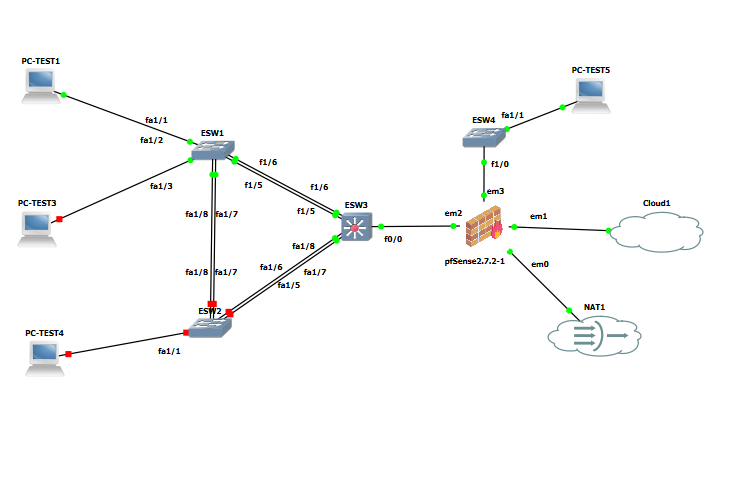
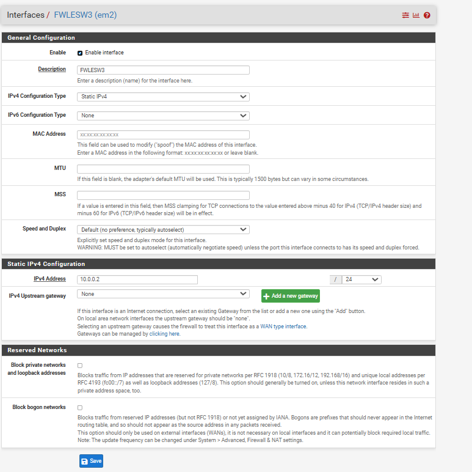
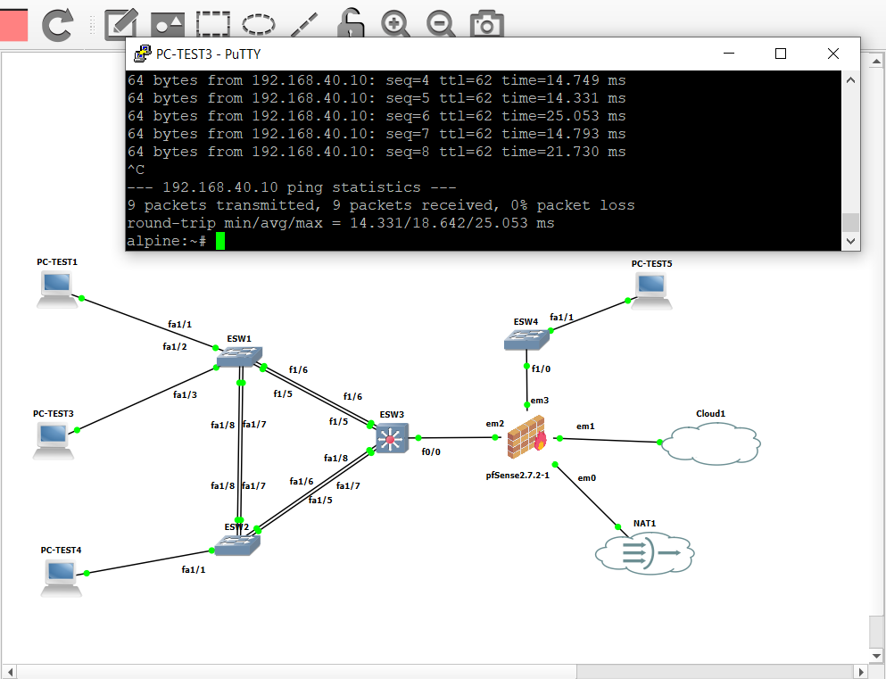

# 🏗️ Architecture Réseau Entreprise — Lab GNS3

> Mise en place d'une infrastructure réseau d'entreprise avec VLANs, EtherChannel, Spanning Tree, routage inter-VLAN et pare-feu pfSense.


---

## 📋 Table des matières

- [Description](#-description)
- [Configuration des VLANs](#-configuration-des-vlans)
- [Test 1 — Connectivité intra-VLAN](#-test-1--connectivité-dans-le-même-vlan)
- [Configuration EtherChannel & STP](#-configuration-etherchannel--stp)
- [Routage inter-VLAN](#-configuration-du-routage-inter-vlan)
- [Configuration pfSense](#-configuration-du-pare-feu-pfsense)
- [Test final](#-test-final--ping-entre-vlans-via-pfsense)
- [Configuration de base & SSH](#️-configuration-de-base--ssh)

---

## 📖 Description

Pour réaliser ce réseau, nous allons configurer le trafic de données et nous assurer que tous les sous-réseaux peuvent communiquer entre eux.

Pour se rapprocher d'une architecture de type entreprise :
- 🔁 Des **boucles réseau** sont présentes et gérées par le Spanning Tree Protocol (STP)
- 🔗 Des **liens EtherChannel** optimisent le flux réseau et assurent la redondance
- 🚦 Le **routage inter-VLAN par switch de niveau 3** est préféré au routage on-stick, plus scalable et plus performant en entreprise
- 🔥 Un **pare-feu pfSense** assure la sécurité périmétrique et le routage vers la DMZ

---

## 🗂️ Configuration des VLANs

### Table des VLANs et affectation des ports

| VLAN ID | Nom | ESW1 | ESW2 | ESW4 | ESW3 |
|---------|-----|------|------|------|------|
| 10 | Users | Fa1/1, Fa1/2 | — | — | — |
| 20 | Admin | Fa1/3, Fa1/4 | — | — | — |
| 30 | Servers | — | Fa1/1–4 | — | — |
| 40 | DMZ | — | — | Fa1/0–4 | — |
| 50 | MGMT | — | — | — | — |
| 90 | Natif | *(trunk natif)* | *(trunk natif)* | *(trunk natif)* | *(trunk natif)* |
| 99 | Poubelle | *(ports inutilisés)* | *(ports inutilisés)* | *(ports inutilisés)* | *(ports inutilisés)* |

> 💡 ESW3 est le switch de niveau 3 dédié au routage inter-VLAN — il ne possède pas de ports d'accès mais des interfaces SVI (interfaces VLAN virtuelles).

---

### ⚙️ Configuration du Switch ESW1

> ⚠️ **Important** : ESW1 (et tous les autres switches) sont des **routeurs Cisco avec module NM-16ESW**. Les commandes de création de VLANs sont différentes d'un switch classique — on utilise `vlan database` depuis le mode exec privilégié (`#`), et non depuis le mode de configuration globale.

#### 1. Création des VLANs

```
ESW1# vlan database
ESW1(vlan)# vlan 10 name Users
ESW1(vlan)# vlan 20 name Admin
ESW1(vlan)# vlan 30 name Servers
ESW1(vlan)# vlan 40 name DMZ
ESW1(vlan)# vlan 50 name MGMT
ESW1(vlan)# vlan 90 name Natif
ESW1(vlan)# vlan 99 name Poubelle
ESW1(vlan)# exit
```

#### 2. Vérification

```
ESW1# show vlan-switch brief
```

#### 3. Affectation des interfaces aux VLANs

```
ESW1# configure terminal
ESW1(config)# interface range fastEthernet 1/1 - 2
ESW1(config-if-range)# switchport mode access
ESW1(config-if-range)# switchport access vlan 10
ESW1(config-if-range)# exit
ESW1(config)# interface range fastEthernet 1/3 - 4
ESW1(config-if-range)# switchport mode access
ESW1(config-if-range)# switchport access vlan 20
ESW1(config-if-range)# end
```

#### 4. Vérification de l'affectation

```
ESW1# show vlan-switch brief
```

---

### ⚙️ Configuration des Switchs ESW2 et ESW4

Répétez la même procédure de création des VLANs (`vlan database`) puis affectez les ports selon la table ci-dessus.

**Exemple pour ESW2 — VLAN 30 :**

```
ESW2# vlan database
ESW2(vlan)# vlan 10 name Users
ESW2(vlan)# vlan 20 name Admin
ESW2(vlan)# vlan 30 name Servers
ESW2(vlan)# vlan 40 name DMZ
ESW2(vlan)# vlan 50 name MGMT
ESW2(vlan)# vlan 90 name Natif
ESW2(vlan)# vlan 99 name Poubelle
ESW2(vlan)# exit

ESW2(config)# interface range fastEthernet 1/1 - 4
ESW2(config-if-range)# switchport mode access
ESW2(config-if-range)# switchport access vlan 30
ESW2(config-if-range)# end
```

---

### ⚙️ Configuration du Switch ESW3

Sur ESW3, **créez uniquement les VLANs** sans affecter de ports d'accès. Ce switch de niveau 3 sera exclusivement dédié au routage inter-VLAN via des interfaces SVI.

```
ESW3# vlan database
ESW3(vlan)# vlan 10 name Users
ESW3(vlan)# vlan 20 name Admin
ESW3(vlan)# vlan 30 name Servers
ESW3(vlan)# vlan 40 name DMZ
ESW3(vlan)# vlan 50 name MGMT
ESW3(vlan)# vlan 90 name Natif
ESW3(vlan)# vlan 99 name Poubelle
ESW3(vlan)# exit
```

---

## ✅ Test 1 — Connectivité dans le même VLAN

À ce stade, **les machines du même VLAN doivent pouvoir communiquer entre elles**. On valide cela avant d'aller plus loin.

**Topologie de test :**


- **PC-test1** → connecté à `Fa1/1` de ESW1 (VLAN 10)
- **PC-test2** → connecté à `Fa1/2` de ESW1 (VLAN 10)

#### Configuration de l'adressage sur PC-test1

```bash
ip addr add 192.168.10.10/24 dev eth0
ip a
```


#### Configuration de l'adressage sur PC-test2

```bash
ip addr add 192.168.10.11/24 dev eth0
ip a
```

#### Test de connectivité

Depuis PC-test1 :

```bash
ping 192.168.10.11
```

🎉 **Le ping doit passer — les deux machines sont dans le même VLAN !**


---

## 🔗 Configuration EtherChannel & STP

### Qu'est-ce que l'EtherChannel ?

L'EtherChannel permet d'**agréger plusieurs liens physiques** entre deux équipements réseau.

> ⚠️ **Point important** : deux liens de 100 Mb/s agrégés ne donnent **pas** un lien de 200 Mb/s. Ils permettent une **meilleure répartition de charge** et une **tolérance aux pannes** — si un lien tombe, le trafic continue sur l'autre.

### Table des EtherChannels

| Port-Channel | Lien | Interfaces côté A | Interfaces côté B |
|---|---|---|---|
| 1 | ESW1 ↔ ESW2 | ESW1 : Fa1/7 – Fa1/8 | ESW2 : Fa1/7 – Fa1/8 |
| 2 | ESW1 ↔ ESW3 | ESW1 : Fa1/5 – Fa1/6 | ESW3 : Fa1/5 – Fa1/6 |
| 3 | ESW2 ↔ ESW3 | ESW2 : Fa1/5 – Fa1/6 | ESW3 : Fa1/7 – Fa1/8 |

> ⚠️ **Avant de commencer** : shutdown les ports concernés avant de créer les EtherChannels, puis rallumez-les uniquement à la fin. Cela évite les erreurs de négociation.

---

### Configuration du Port-Channel 1 sur ESW1 (ESW1 ↔ ESW2)

```
ESW1(config)# interface range fastEthernet 1/7 - 8
ESW1(config-if-range)# switchport
ESW1(config-if-range)# shutdown
ESW1(config-if-range)# channel-group 1 mode on
ESW1(config-if-range)# exit

ESW1(config)# interface port-channel 1
ESW1(config-if)# switchport mode trunk
ESW1(config-if)# switchport trunk allowed vlan all
ESW1(config-if)# switchport trunk native vlan 90
ESW1(config-if)# exit

ESW1(config)# interface range fastEthernet 1/7 - 8
ESW1(config-if-range)# no shutdown
ESW1(config-if-range)# end
```

Répétez cette procédure pour les autres port-channels en adaptant les numéros d'interfaces et de port-channel selon la table ci-dessus.

#### Vérification

```
ESW1# show etherchannel summary
```

La sortie doit afficher les port-channels avec le flag **`SU`** (en service) et les interfaces membres avec le flag **`P`** (bundled) :


---

### Configuration du Spanning Tree Protocol (STP)

Le STP évite les boucles réseau en bloquant certains liens redondants. L'objectif ici est que **ESW3 soit le Root Bridge pour tous les VLANs**, ce qui lui permet de contrôler le chemin du trafic et d'optimiser le routage inter-VLAN.

#### 1. Vérification du Root Bridge actuel

```
ESW3# show spanning-tree brief
```

Observez la sortie : ESW3 doit apparaître comme **This bridge is the root** pour chaque VLAN.

#### 2. Si ESW3 n'est pas Root Bridge — Forcer la priorité

Une priorité plus basse = meilleure chance d'être élu Root Bridge. La valeur `4096` est suffisamment basse pour garantir l'élection.

```
ESW3(config)# spanning-tree vlan 10 priority 4096
ESW3(config)# spanning-tree vlan 20 priority 4096
ESW3(config)# spanning-tree vlan 30 priority 4096
ESW3(config)# spanning-tree vlan 40 priority 4096
ESW3(config)# spanning-tree vlan 50 priority 4096
ESW3(config)# spanning-tree vlan 90 priority 4096
ESW3(config)# end
```

#### 3. Vérification finale

```
ESW3# show spanning-tree brief
```

> 💡 Si la configuration est correcte, ESW3 est Root Bridge et le lien entre ESW1 et ESW2 apparaît en état **BLK (Blocked)**. C'est le comportement **attendu** du STP — ce lien reste en veille et prend le relais uniquement si un autre lien tombe.

---

### 🔒 Isolation des ports non utilisés

Par mesure de sécurité, les ports inutilisés sont affectés au **VLAN 99 (Poubelle)** et désactivés. Cela empêche toute connexion non autorisée sur ces ports.

> ⚠️ **Rappel** : Sur un routeur avec module NM-16ESW, les ports `Fa0/x` sont des **ports routeur** — ne les touchez pas ici. Seuls les ports `Fa1/x` sont des ports commutateur.

Identifiez les ports inutilisés sur chaque switch, puis appliquez :

```
ESW1(config)# interface range fastEthernet 1/5 - 15
ESW1(config-if-range)# shutdown
ESW1(config-if-range)# switchport mode access
ESW1(config-if-range)# switchport access vlan 99
ESW1(config-if-range)# end
```

Résultat attendu :


> ⚠️ **Appliquez cette mesure sur ESW1, ESW2, ESW3 et ESW4 !**

---

## 🚦 Configuration du Routage inter-VLAN

### Pourquoi le switch de niveau 3 ?

Le routage inter-VLAN par switch L3 est la méthode privilégiée en entreprise. Le routage on-stick (Router-on-a-Stick) est limité à environ 50 VLANs et crée un goulot d'étranglement sur un seul lien physique. Le switch L3 n'a pas ces limitations.

### Table d'adressage des interfaces VLAN (SVI)

| VLAN | Nom | Réseau | IP Gateway (ESW3) |
|------|-----|--------|-------------------|
| 10 | Users | 192.168.10.0/24 | 192.168.10.1 |
| 20 | Admin | 192.168.20.0/24 | 192.168.20.1 |
| 30 | Servers | 192.168.30.0/24 | 192.168.30.1 |
| 50 | MGMT | 192.168.50.0/24 | 192.168.50.1 |

> 💡 **Pourquoi pas de SVI pour le VLAN 40 (DMZ) ?** La DMZ est hébergée sur un sous-réseau distinct, géré directement par le pare-feu pfSense. Le trafic à destination de la DMZ sera acheminé via la route par défaut vers le firewall — pas besoin d'interface SVI pour ce VLAN.

---

### Création des interfaces VLAN (SVI) sur ESW3

```
ESW3(config)# interface vlan 10
ESW3(config-if)# description Gateway VLAN 10 - Users
ESW3(config-if)# ip address 192.168.10.1 255.255.255.0
ESW3(config-if)# no shutdown
ESW3(config-if)# exit

ESW3(config)# interface vlan 20
ESW3(config-if)# description Gateway VLAN 20 - Admin
ESW3(config-if)# ip address 192.168.20.1 255.255.255.0
ESW3(config-if)# no shutdown
ESW3(config-if)# exit

ESW3(config)# interface vlan 30
ESW3(config-if)# description Gateway VLAN 30 - Servers
ESW3(config-if)# ip address 192.168.30.1 255.255.255.0
ESW3(config-if)# no shutdown
ESW3(config-if)# exit

ESW3(config)# interface vlan 50
ESW3(config-if)# description Gateway VLAN 50 - MGMT
ESW3(config-if)# ip address 192.168.50.1 255.255.255.0
ESW3(config-if)# no shutdown
ESW3(config-if)# exit
```

### Activation du routage IP

Sans cette commande, ESW3 reste un switch — il ne routera pas entre les VLANs.

```
ESW3(config)# ip routing
ESW3(config)# end
```

### Vérification des interfaces SVI

```
ESW3# show ip interface brief | section Vlan
```


```
ESW3# show ip route
```


> 💡 Vous remarquerez **l'absence de route vers le réseau DMZ** — c'est normal et attendu. Ce réseau héberge les services web et DNS, et son trafic sera redirigé vers le firewall via la route par défaut configurée ci-dessous.

---

### Configuration de l'interface vers le Firewall et de la route par défaut

#### Table d'adressage du lien WAN (ESW3 ↔ pfSense)

| Équipement | Interface | Adresse IP |
|---|---|---|
| ESW3 (Switch L3) | Fa0/0 | 10.0.0.1/24 |
| pfSense (Firewall) | em2 | 10.0.0.2/24 |

```
ESW3(config)# interface fastEthernet 0/0
ESW3(config-if)# ip address 10.0.0.1 255.255.255.0
ESW3(config-if)# no shutdown
ESW3(config-if)# exit

ESW3(config)# ip route 0.0.0.0 0.0.0.0 10.0.0.2
ESW3(config)# end
```

> ⚠️ **Note** : Dans la capture ci-dessous, vous pouvez voir `fastEthernet 0/0` au lieu de `10.0.0.2` comme next-hop dans la route par défaut — c'est une erreur de saisie lors du lab. Assurez-vous bien d'utiliser l'adresse IP `10.0.0.2` comme indiqué dans la commande ci-dessus.

Vérification de la table de routage :

```
ESW3# show ip route
```


---

## ✅ Test 2 — Connectivité inter-VLAN

Ajoutez deux nouvelles machines Alpine Linux dans la topologie et configurez-les :

| Machine | Connectée à | Adresse IP | Passerelle |
|---------|-------------|------------|------------|
| PC-test3 | Fa1/3 de ESW1 | 192.168.20.10/24 | 192.168.20.1 |
| PC-test4 | Fa1/1 de ESW2 | 192.168.30.10/24 | 192.168.30.1 |

```bash
# PC-test3 (VLAN 20 - Admin)
ip addr add 192.168.20.10/24 dev eth0
ip route add default via 192.168.20.1

# PC-test4 (VLAN 30 - Servers)
ip addr add 192.168.30.10/24 dev eth0
ip route add default via 192.168.30.1
```

> ⚠️ **N'oubliez pas la gateway !** Sans la route par défaut, les machines ne peuvent pas communiquer en dehors de leur propre sous-réseau.

```bash
ping 192.168.30.10
```

🎉 **Le ping inter-VLAN doit passer !**


---

## 🔥 Configuration du Pare-feu pfSense

> 💡 **Pourquoi pfSense et pas FortiGate ?** Suite à des contraintes de configuration rencontrées lors du lab, pfSense est utilisé à la place de FortiGate. Les principes de routage et de filtrage restent identiques.

**Topologie avec pfSense :**



### Architecture de connexion

| Nœud | Rôle | Connexion |
|------|------|-----------|
| **Cloud1** | Serveur GNS3 | Relié à `eth0` de pfSense |
| **NAT** | ISP / accès Internet (votre PC physique) | Relié à pfSense |
| **pfSense** | Pare-feu | Connecté à ESW3 via `em2` |

> 💡 Pour l'installation de pfSense et l'accès à l'interface graphique, de nombreux tutoriels sont disponibles en ligne. Lors de la configuration initiale, laissez l'interface LAN en **DHCP** pour récupérer automatiquement une adresse IP à saisir dans votre navigateur.

---

### Configuration des interfaces réseau de pfSense

Rendez-vous dans **Interfaces → Assignments**, puis configurez les interfaces selon le tableau suivant :

| Interface pfSense | Rôle | Adresse IP |
|---|---|---|
| em2 | Lien vers ESW3 (WAN interne) | 10.0.0.2/24 |
| em3 | Gateway DMZ | 192.168.40.1/24 |

Cliquez sur **Add**, sélectionnez l'interface, puis configurez l'adresse IP statique. Voici un exemple pour `em2` :



Répétez l'opération pour `em3`.

---

### Configuration du routage statique

#### Étape 1 — Créer la gateway vers ESW3

1. Aller dans **System → Routing → Gateways**
2. Cliquer sur **Add**
3. Remplir les champs :

| Champ | Valeur |
|-------|--------|
| Interface | em2 |
| Name | STATIC_TO_ESW3 |
| Gateway | 10.0.0.1 |

4. Cliquer **Save**, puis **Apply Changes**

---

#### Étape 2 — Ajouter les routes statiques vers les VLANs

1. Aller dans **System → Routing → Static Routes**
2. Cliquer sur **Add** et créer une route pour chaque réseau :

| Réseau de destination | Gateway |
|-----------------------|---------|
| 192.168.10.0/24 | STATIC_TO_ESW3 |
| 192.168.20.0/24 | STATIC_TO_ESW3 |
| 192.168.30.0/24 | STATIC_TO_ESW3 |
| 192.168.50.0/24 | STATIC_TO_ESW3 |

3. Cliquer **Save**, puis **Apply Changes** après chaque ajout

---

### Configuration des règles Firewall

#### Règle 1 — Autoriser le trafic des VLANs vers pfSense

1. Aller dans **Firewall → Rules → em2**
2. Cliquer sur **Add ↑**
3. Configurer la règle :

| Champ | Valeur |
|-------|--------|
| Action | Pass |
| Protocol | IPv4 * |
| Source | any |
| Destination | any |

4. Cliquer **Save**, puis **Apply Changes**

---

#### Règle 2 — Autoriser le trafic de la DMZ

1. Aller dans **Firewall → Rules → em3**
2. Cliquer sur **Add**
3. Configurer la règle :

| Champ | Valeur |
|-------|--------|
| Action | Pass |
| Protocol | IPv4 * |
| Source | any |
| Destination | any |

4. Cliquer **Save**, puis **Apply Changes**

---

### ✅ Test final — Ping entre VLANs via pfSense

Si toute la configuration est correcte, un ping depuis un VLAN interne vers la DMZ doit passer à travers pfSense.

Ici, le ping de **PC-test3 → PC-test5** (DMZ) fonctionne parfaitement :



---

## 🛠️ Configuration de base & SSH

Maintenant que la connectivité de bout en bout est établie, nous allons appliquer les **configurations de base** sur chaque switch et **activer SSH** pour un accès sécurisé à distance.

> 🚧 **Section à venir** — Configuration du hostname, bannière, mot de passe enable, et activation de SSH sur ESW1, ESW2, ESW3 et ESW4.

---

## 📌 Récapitulatif des commandes utiles

| Commande | Description |
|----------|-------------|
| `show vlan-switch brief` | Affiche les VLANs et les ports associés |
| `show interfaces status` | Affiche l'état de toutes les interfaces |
| `show etherchannel summary` | Affiche l'état des EtherChannels |
| `show spanning-tree brief` | Affiche l'état du Spanning Tree |
| `show ip interface brief` | Affiche l'état des interfaces IP |
| `show ip route` | Affiche la table de routage |
| `show arp` | Affiche la table ARP |
| `show running-config` | Affiche la configuration active |

---

*Lab réalisé sur GNS3 avec routeurs Cisco équipés du module NM-16ESW et pare-feu pfSense.*
