# 🏗️ Architecture Réseau Entreprise — Lab GNS3

> Mise en place d'une infrastructure réseau d'entreprise avec VLANs, EtherChannel, Spanning Tree, routage inter-VLAN et pare-feu FortiGate.


---

## 📋 Table des matières

- [Description](#-description)
- [Configuration des VLANs](#-configuration-des-vlans)
- [Configuration EtherChannel & STP](#-configuration-etherchannel--stp)
- [Routage inter-VLAN](#-configuration-du-routage-inter-vlan)
- [Configuration FortiGate](#-configuration-du-pare-feu-fortigate)
- [Tests de connectivité](#-tests-de-connectivité)

---

## 📖 Description

Pour réaliser ce réseau, nous allons d'abord configurer le trafic de données et nous assurer que les sous-réseaux peuvent communiquer entre eux.

Pour se rapprocher d'une architecture de type entreprise :
- 🔁 Des **boucles réseau** sont présentes et gérées par le Spanning Tree Protocol
- 🔗 Des **liens EtherChannel** optimisent le flux réseau
- 🚦 Le **routage inter-VLAN par switch de niveau 3** est préféré au routage on-stick, pour sa meilleure efficacité et sa capacité à gérer plus de 50 VLANs

---

## 🗂️ Configuration des VLANs

### Table des VLANs

# 🗂️ Résumé VLAN / Interfaces par Switch (sans SVI)

+--------+---------------------------+---------------------------+------------------------------+------------------------------+
| VLAN   | ESW1                     | ESW2                     | ESW4                        | ESW3                         |
+--------+---------------------------+---------------------------+------------------------------+------------------------------+
| 10     | FA1/1, FA1/2             | —                         | —                            | —                            |
| 20     | FA1/3, FA1/4             | —                         | —                            | —                            |
| 30     | —                         | FA1/1–4                   | —                            | —                            |
| 40     | —                         | —                         | FA1/1–4                      | —                            |
| 50     | —                         | —                         | —                            | —                            |
| 90     | —                         | —                         | —                            | —                            |
| 99     | Ports inutilisés         | Ports inutilisés         | Ports inutilisés             | Ports inutilisés             |
+--------+---------------------------+---------------------------+------------------------------+------------------------------+

---

### ⚙️ Configuration du Switch ESW1

> ⚠️ **Important** : ESW1 est un routeur Cisco avec module NM-16ESW. Les commandes de création de VLANs sont différentes d'un switch classique — on utilise `vlan database` depuis le mode exec privilégié.

#### 1. Création des VLANs

```
ESW1# vlan database
ESW1(vlan)# vlan 10 name Users
ESW1(vlan)# vlan 20 name Admin
ESW1(vlan)# vlan 30 name Servers
ESW1(vlan)# vlan 40 name DMZ
ESW1(vlan)# vlan 50 name MGMT
ESW1(vlan)# vlan 90 name Natif
ESW1(vlan)# vlan 99 name Poubelle
ESW1(vlan)# exit
```

#### 2. Vérification

```
ESW1# show vlan-switch brief
```

#### 3. Affectation des interfaces aux VLANs

```
ESW1# configure terminal
ESW1(config)# interface range fastEthernet 1/1 - 2
ESW1(config-if-range)# switchport mode access
ESW1(config-if-range)# switchport access vlan 10
ESW1(config-if-range)# exit
ESW1(config)# interface range fastEthernet 1/3 - 4
ESW1(config-if-range)# switchport mode access
ESW1(config-if-range)# switchport access vlan 20
ESW1(config-if-range)# end
```

#### 4. Vérification de l'affectation

```
ESW1# show vlan-switch brief
```

---

### ⚙️ Configuration des Switchs ESW2 et ESW4

Répétez la même procédure en vous basant sur la table des VLANs ci-dessus, en adaptant les numéros d'interfaces et de VLANs selon votre table d'affectation.

---

### ⚙️ Configuration du Switch ESW3

Sur ESW3, **créez uniquement les VLANs** (sans affectation de ports d'accès), car ce switch de niveau 3 sera dédié au routage inter-VLAN.

```
ESW3# vlan database
ESW3(vlan)# vlan 10 name Users
ESW3(vlan)# vlan 20 name Admin
ESW3(vlan)# vlan 30 name Servers
ESW3(vlan)# vlan 40 name DMZ
ESW3(vlan)# vlan 50 name MGMT
ESW3(vlan)# vlan 90 name Natif
ESW3(vlan)# vlan 99 name Poubelle
ESW3(vlan)# exit
```

---

## ✅ Test 1 — Connectivité dans le même VLAN

À ce stade, les machines du même VLAN doivent pouvoir communiquer entre elles.

**Topologie de test :**

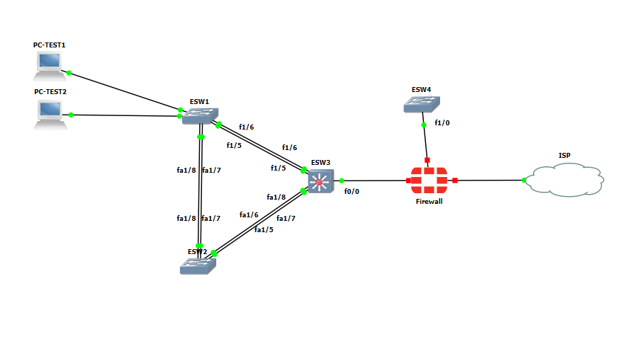

- **PC-test1** → connecté à `Fa1/1` de ESW1
- **PC-test2** → connecté à `Fa1/2` de ESW1

#### Configuration de l'adressage sur PC-test1

```bash
ip addr add 192.168.10.10/24 dev eth0
ip a
```

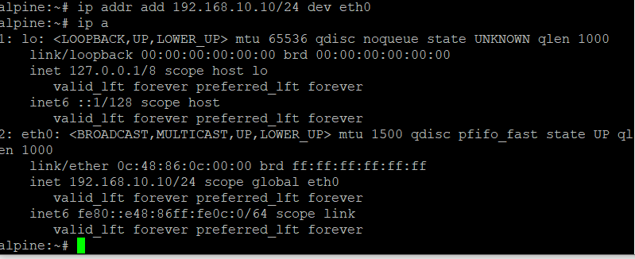

#### Configuration de l'adressage sur PC-test2

```bash
ip addr add 192.168.10.11/24 dev eth0
ip a
```

#### Test de connectivité

```bash
ping 192.168.10.11
```

🎉 **Si tout est bien configuré, le ping doit passer !**

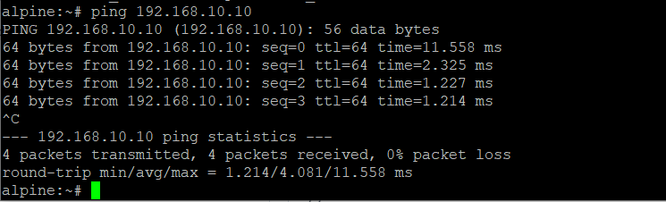

---

## 🔗 Configuration EtherChannel & STP

Les liens EtherChannel permettent d'**agréger plusieurs liens physiques** pour optimiser la bande passante et la redondance. Deux liens de 100 Mb/s agrégés ne forment pas un lien de 200 Mb/s — ils permettent une meilleure répartition de charge et une tolérance aux pannes.

### Table des EtherChannels

+----------------------+---------------------------+-------------------------------------------+
| Port-Channel (ID)    | Switches concernés        | Interfaces utilisées                      |
+----------------------+---------------------------+-------------------------------------------+
| Port-Channel 1       | ESW1 ↔ ESW2               | ESW1: fa1/7–fa1/8   | ESW2: fa1/7–fa1/8   |
|                      |                           | 
+----------------------+---------------------------+-------------------------------------------+
| Port-Channel 2       | ESW1 ↔ ESW3               | ESW1: fa1/5–fa1/6   | ESW3: fa1/5–fa1/6   |
+----------------------+---------------------------+-------------------------------------------+
| Port-Channel 3       | ESW2 ↔ ESW3               | ESW2: fa1/5–fa1/6   | ESW3: fa1/7–fa1/8   |
+----------------------+---------------------------+-------------------------------------------+


> ⚠️ **Attention** : Avant de créer les EtherChannels, **shutdown les ports concernés**, puis rallumez-les uniquement à la fin de la configuration.

---

### Configuration du Port-Channel 1 (sur ESW1)

```
ESW1(config)# interface range fastEthernet 1/7 - 8
ESW1(config-if-range)# switchport
ESW1(config-if-range)# shutdown
ESW1(config-if-range)# channel-group 1 mode on
ESW1(config-if-range)# exit

ESW1(config)# interface port-channel 1
ESW1(config-if)# switchport mode trunk
ESW1(config-if)# switchport trunk allowed vlan all
ESW1(config-if)# switchport trunk native vlan 90
ESW1(config-if)# exit

ESW1(config)# interface range fastEthernet 1/7 - 8
ESW1(config-if-range)# no shutdown
ESW1(config-if-range)# end
```

Répétez cette procédure pour les autres port-channels en adaptant les paramètres selon votre table.

#### Vérification

```
ESW1# show etherchannel summary
```

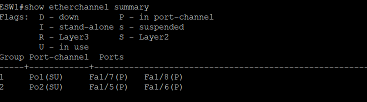

---

### Configuration du Spanning Tree Protocol (STP)

L'objectif est que **ESW3** (le switch de niveau 3) soit le **Root Bridge** pour tous les VLANs, afin de maîtriser le chemin du trafic réseau.

#### 1. Vérification du Root Bridge actuel

```
ESW3# show spanning-tree brief
```

Observez la sortie : ESW3 doit apparaître comme Root Bridge pour tous les VLANs.

#### 2. Si ESW3 n'est pas Root Bridge — Forcer la priorité

```
ESW3(config)# spanning-tree vlan 10 priority 4096
ESW3(config)# spanning-tree vlan 20 priority 4096
ESW3(config)# spanning-tree vlan 30 priority 4096
ESW3(config)# spanning-tree vlan 40 priority 4096
ESW3(config)# spanning-tree vlan 50 priority 4096
ESW3(config)# spanning-tree vlan 90 priority 4096
```

#### 3. Vérification finale du STP

```
ESW3# show spanning-tree brief
```

> 💡 Si la configuration est correcte, ESW3 est Root Bridge et le lien entre ESW1 et ESW2 apparaît en état **BLK (Blocked)** — c'est le comportement attendu du STP pour éviter les boucles.

---

### 🔒 Isolation des ports non utilisés

Par mesure de sécurité, les ports inutilisés sont affectés au **VLAN 99 (Poubelle)** et désactivés.

> ⚠️ **Rappel** : Sur un routeur avec module NM-16ESW, les ports `Fa0/x` sont des ports **routeur** — ne les touchez pas. Seuls les ports `Fa1/x` sont des ports **commutateur**.

```
ESW1(config)# interface range fastEthernet 1/*** - ***
ESW1(config-if-range)# shutdown
ESW1(config-if-range)# switchport mode access
ESW1(config-if-range)# switchport access vlan 99
ESW1(config-if-range)# end
```

Résultat attendu :

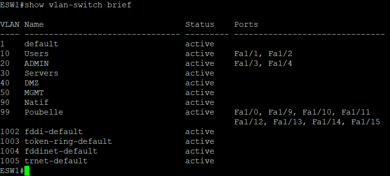

> ⚠️ **N'oubliez pas d'appliquer cette mesure de sécurité sur ESW4,ESW2,ESW3 également !**

---

## 🚦 Configuration du Routage inter-VLAN

Le routage inter-VLAN par **switch de niveau 3** est la méthode privilégiée en entreprise. Contrairement au routage on-stick (limité à ~50 VLANs), cette approche est plus scalable et plus performante.

### Table d'adressage des interfaces VLAN (SVI)

+-----------+-----------+--------------------+--------------------+
| VLAN NAME | VLAN ID   | RÉSEAU             | IP SVI ESW3        |
+-----------+-----------+--------------------+--------------------+
| USERS     | 10        | 192.168.10.0/24    | 192.168.10.1       |
| ADMIN     | 20        | 192.168.20.0/24    | 192.168.20.1       |
| SERVERS   | 30        | 192.168.30.0/24    | 192.168.30.1       |
| MGMT      | 50        | 192.168.50.0/24    | 192.168.50.1       |
+-----------+-----------+--------------------+--------------------+

> 💡 **Pourquoi pas de SVI pour le VLAN 40 (DMZ) ?** La DMZ est sur un sous-réseau distinct géré par le pare-feu FortiGate. Le trafic vers la DMZ sera acheminé via la route par défaut vers le firewall.

---

### Création des interfaces VLAN (SVI) sur ESW3

```
ESW3(config)# interface vlan 10
ESW3(config-if)# description Gateway VLAN 10 - Users
ESW3(config-if)# ip address 192.168.10.1 255.255.255.0
ESW3(config-if)# no shutdown
ESW3(config-if)# exit

ESW3(config)# interface vlan 20
ESW3(config-if)# description Gateway VLAN 20 - Admin
ESW3(config-if)# ip address 192.168.20.1 255.255.255.0
ESW3(config-if)# no shutdown
ESW3(config-if)# exit

ESW3(config)# interface vlan 30
ESW3(config-if)# description Gateway VLAN 30 - Servers
ESW3(config-if)# ip address 192.168.30.1 255.255.255.0
ESW3(config-if)# no shutdown
ESW3(config-if)# exit
```

Répétez pour les autres VLANs selon votre table d'adressage.

### Activation du routage IP

```
ESW3(config)# ip routing
ESW3(config)# end
```

### Vérification

```
ESW3# show ip interface brief | section Vlan
```

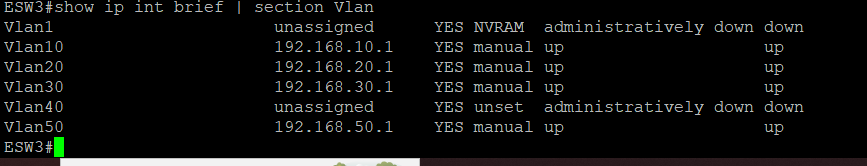

```
ESW3# show ip route
```

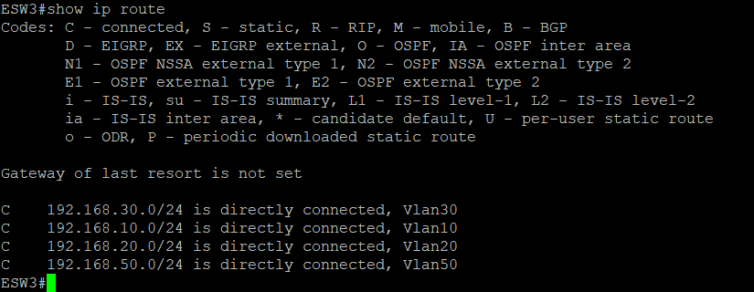

> 💡 **Vous remarquerez qu'il n'y a pas de route vers le réseau DMZ** — c'est normal ! Ce réseau héberge les services web et DNS, et le trafic sera redirigé vers le firewall via la route par défaut.

---

### Configuration de l'interface vers le FireWall et de la route par défaut

#### Table d'adressage WAN

# 🌐 Tableau des adresses WAN (ESW3 ↔ Firewall)

+----------------------+------------------+------------------+
| Équipement           | Interface        | Adresse IP       |
+----------------------+------------------+------------------+
| ESW3 (Switch L3)     | fa0/0            | 10.0.0.1/24      |
| Firewall FortiGate   | port2            | 10.0.0.2/24      |
+----------------------+------------------+------------------+


```
ESW3(config)# interface fastEthernet 0/0
ESW3(config-if)# ip address 10.0.0.1 255.255.255.0
ESW3(config-if)# no shutdown
ESW3(config-if)# exit

ESW3(config)# ip route 0.0.0.0 0.0.0.0 fastEthernet 0/0
ESW3(config)# end
```

Vérification de la table de routage :

```
ESW3# show ip route
```


---

## ✅ Test 2 — Connectivité inter-VLAN

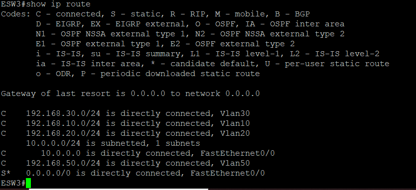

Ajoutez deux nouvelles machines Alpine Linux dans la topologie :

#### Configuration de l'adressage et de la passerelle

Sur chaque machine, configurez l'adresse IP et ajoutez la route par défaut :

```bash
# Exemple pour PC-test3 (VLAN 20)
ip addr add 192.168.20.10/24 dev eth0
ip route add default via 192.168.20.1

# Exemple pour PC-test4 (VLAN 30)
ip addr add 192.168.30.10/24 dev eth0
ip route add default via 192.168.30.1
```

#### Test de connectivité inter-VLAN

```bash
ping 192.168.30.10
```

🎉 **Si tout est bien configuré, le ping inter-VLAN doit passer !**

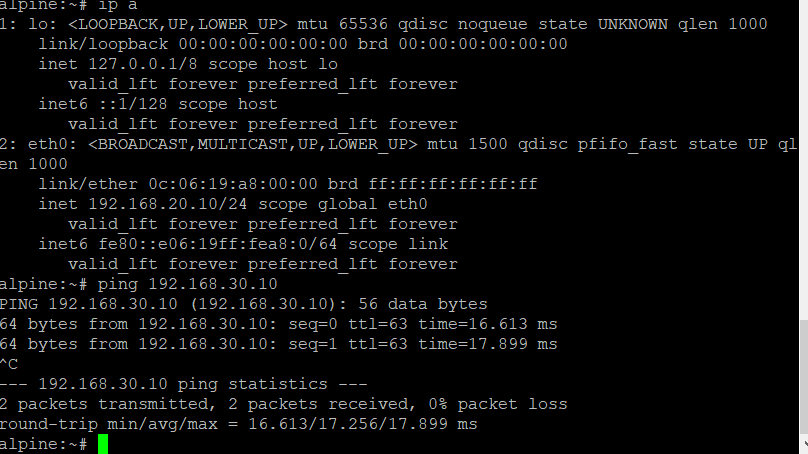

---

## 🔥 Configuration du Pare-feu FortiGate

Accédez à l'interface web de FortiGate via son adresse IP de management en HTTPS :


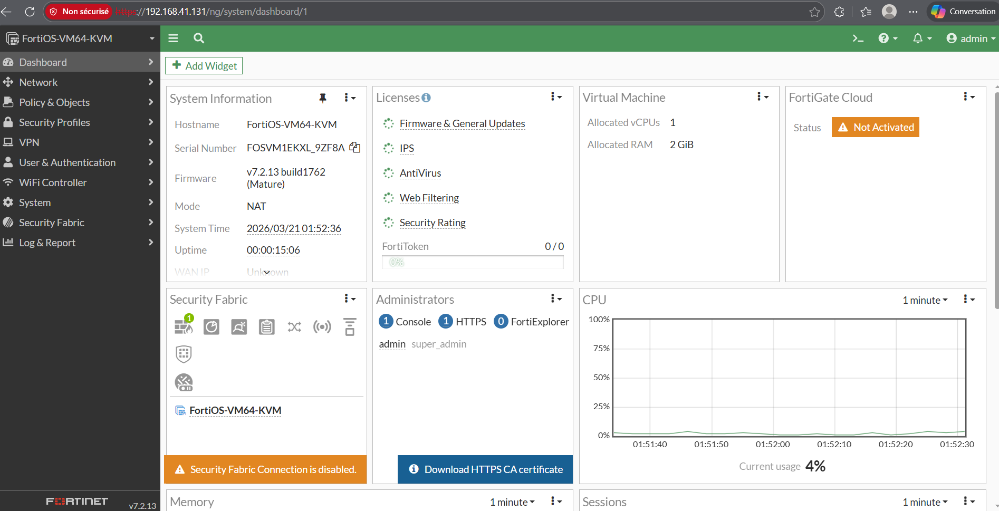

Rendez-vous dans **Network > Interfaces** et configurez les interfaces selon votre table d'adressage :

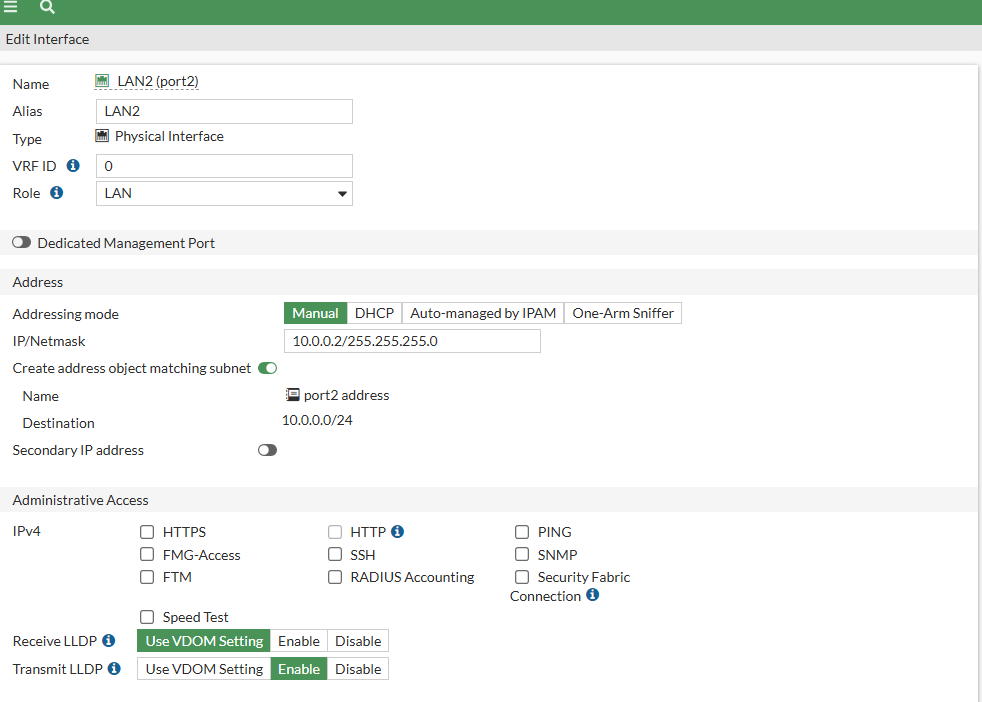
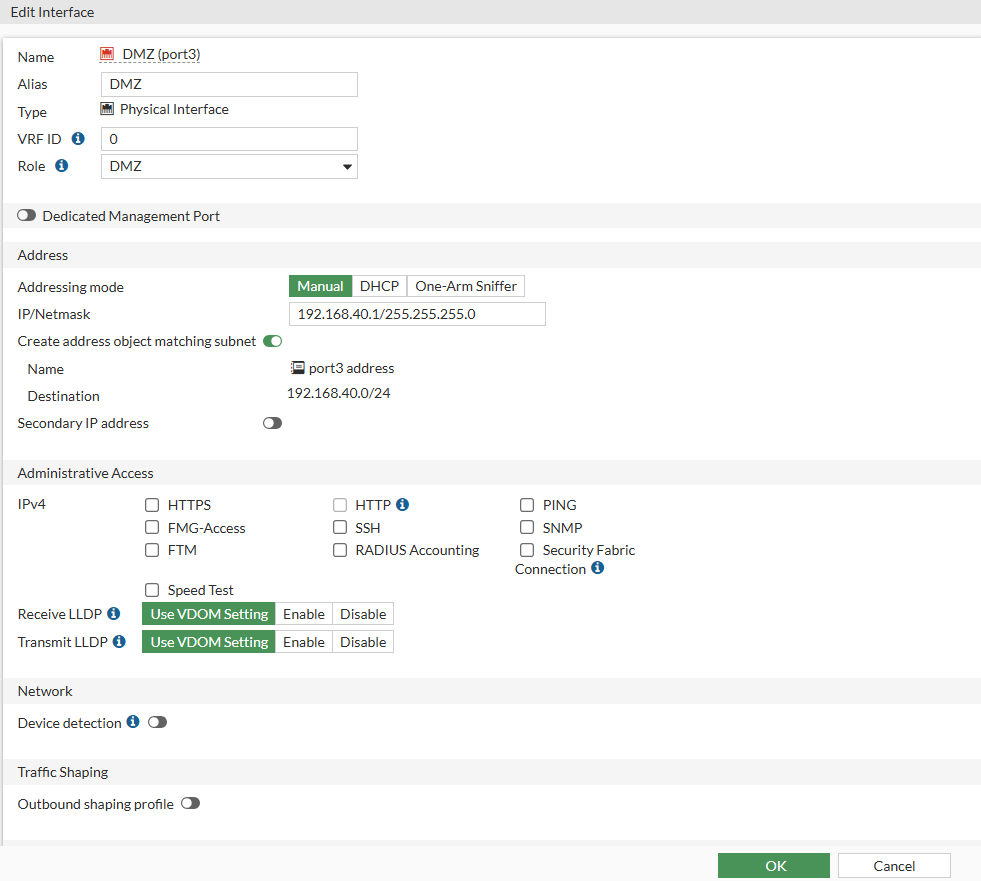


*Lab réalisé sur GNS3 avec routeurs Cisco équipés du module NM-16ESW et pare-feu FortiGate.*
