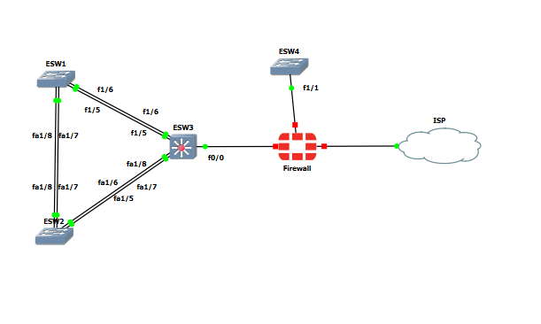

# Description

Pour realiser notre reseaqu nous allons d'abord configurer le traffic de donnes , s'assurer que les sous reseau peuvent communiquer
entre eux.Pour se rapprocher d'une architecture de type entreprise , il y a des boucles reseaux et des liens etherchannel afin doptimiser le flux , le routage intervaln est prefere a celui du routage on stick , 
grace a sa capacite de routage plus efficace.

# Configuration des vlans

## Configuration du Switch ESW1

### Creation des Vlans 
Vu que c'est un routeur avec un module de commutateur lesw commandes sont un peu differentes.
Sur la ligne de commande entrer :

vlan database
vlan 10 name Users
vlan 20 name Admin
vlan 30 name Servers
vlan 40 name DMZ
vlan 50 name MGMT
vlan 90 name Natif
vlan 99 name Poubelle
end

### Verification de la creation des vlan

show vlan-switch brief

### Affectation des interfaces aux vlans

conf t
int range fa1/1 - 2
switchport mode access
switchport access vlan 10
int range fa1/3-4
switchport mode access 
switchport access vlan 20
end

### Verification de l'affectation des interfaces

show vlan-switch brief

## Configuration du Switch ESW2

Repetez la meme procedure selon la table de vlan

## Configuration du Switch ESW3

Creez juste les vlans 

