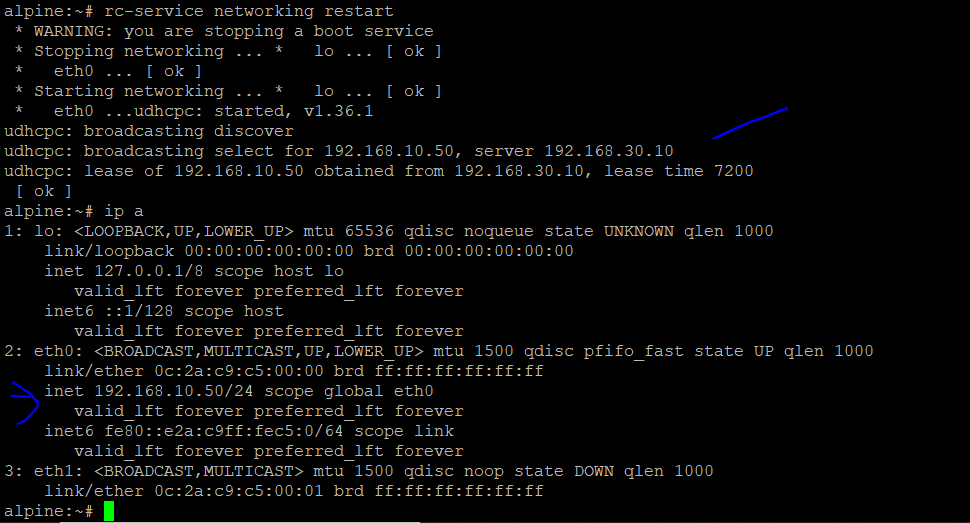
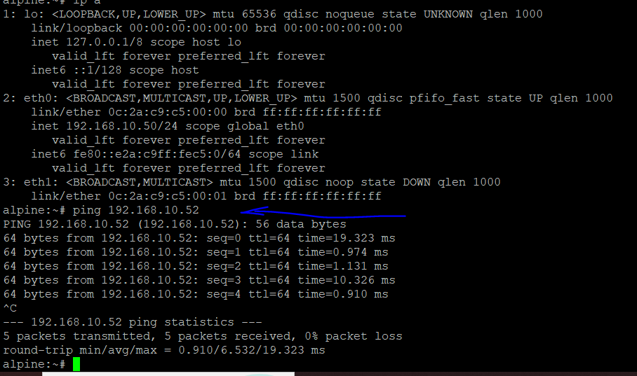

# 📡 Configuration du service DHCP — Kea

> Mise en place du service DHCP avec Kea pour l'attribution automatique d'adresses IP aux machines utilisateur.


---

## 📋 Informations sur le pool DHCP

| VLAN | Réseau | Plage d'attribution | Gateway | DNS | Durée |
|------|--------|---------------------|---------|-----|-------|
| 10 — Users | 192.168.10.0/24 | 192.168.10.50 – .150 | 192.168.10.1 | 192.168.40.12 | 24h |

> 💡 On utilise **Kea DHCP** plutôt qu'ISC DHCP — c'est la solution moderne et la plus répandue en entreprise.

---

## 1. Installation de Kea

Connectez-vous au serveur `srv-dhcp` en SSH, puis installez Kea :

```sh
apk update
apk add kea-dhcp4
```

---

## 2. Configuration de Kea

Ouvrez le fichier de configuration :

```sh
vi /etc/kea/kea-dhcp4.conf
```

Supprimez tout le contenu existant et remplacez-le par la configuration suivante :

```json
{
  "Dhcp4": {
    "interfaces-config": {
      "interfaces": ["eth0"]
    },
    "control-socket": {
      "socket-type": "unix",
      "socket-name": "/run/kea/kea-dhcp4-ctrl.sock"
    },
    "lease-database": {
      "type": "memfile",
      "persist": true,
      "name": "/var/lib/kea/kea-leases4.csv",
      "lfc-interval": 3600
    },
    "subnet4": [
      {
        "id": 1,
        "subnet": "192.168.10.0/24",
        "pools": [ { "pool": "192.168.10.50 - 192.168.10.150" } ],
        "option-data": [
          {
            "name": "routers",
            "data": "192.168.10.1"
          },
          {
            "name": "domain-name-servers",
            "data": "192.168.40.12"
          }
        ]
      }
    ],
    "loggers": [
      {
        "name": "kea-dhcp4",
        "output_options": [
          {
            "output": "/var/log/kea-dhcp4.log"
          }
        ],
        "severity": "INFO"
      }
    ]
  }
}
```

---

## 3. Vérifications préalables

Avant de démarrer le service, quelques points sont à vérifier.

### Fichier de log

```sh
ls -l /var/log/kea-dhcp4.log
```

S'il n'existe pas, créez-le :

```sh
touch /var/log/kea-dhcp4.log
chown kea:kea /var/log/kea-dhcp4.log
chmod 664 /var/log/kea-dhcp4.log
```

### IP statique du serveur

```sh
ip addr show eth0
```

### Dossier des leases

C'est ici que Kea enregistre les adresses IP déjà attribuées.

```sh
ls -ld /var/lib/kea/
```

S'il n'existe pas, créez-le :

```sh
mkdir -p /var/lib/kea/
chown kea:kea /var/lib/kea/
```

### Validation de la configuration

Kea dispose d'un outil intégré pour détecter les erreurs dans le fichier JSON avant le lancement :

```sh
kea-dhcp4 -t /etc/kea/kea-dhcp4.conf
```

---

## 4. Démarrage du service

```sh
rc-update add kea-dhcp4 default   # Lancement automatique au démarrage
rc-service kea-dhcp4 start        # Démarrage immédiat
rc-service kea-dhcp4 status       # Vérification du statut
```

---

## 5. Configuration du relais DHCP sur le switch core

Les requêtes DHCP des machines du VLAN 10 doivent être relayées vers `srv-dhcp`. Cette configuration se fait sur **CORE_SWITCH (ESW3)**.

Connectez-vous en SSH — vous pourrez rencontrer des problèmes de compatibilité d'algorithmes, réglables avec les paramètres suivants :

```sh
ssh -o KexAlgorithms=+diffie-hellman-group1-sha1 \
    -o HostKeyAlgorithms=+ssh-rsa \
    -c aes128-cbc \
    admin@192.168.50.1
```

Puis configurez le relais DHCP sur l'interface VLAN 10 :

```
configure terminal
interface vlan 10
 ip helper-address 192.168.30.10
exit
service dhcp
exit
copy running-config startup-config
```

---

## 6. Configuration des machines utilisateur en DHCP

Sur `user1` et `user2`, ouvrez le fichier réseau :

```sh
vi /etc/network/interfaces
```

Assurez-vous que la configuration de `eth0` ressemble à ceci — il s'agit souvent de simplement décommenter la bonne ligne :

```
auto lo
iface lo inet loopback

auto eth0
iface eth0 inet dhcp
```

Redémarrez le service réseau :

```sh
rc-service networking restart
```

---

## ✅ Résultat

Les machines utilisateur reçoivent bien une adresse IP du serveur Kea :



Et la connectivité réseau est confirmée :


