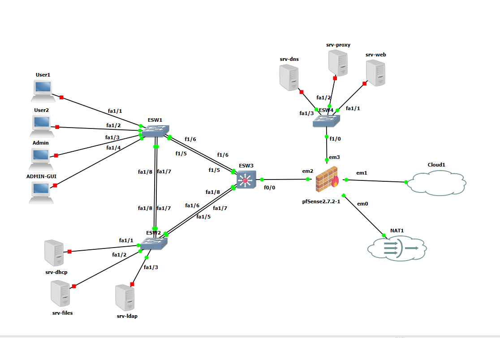
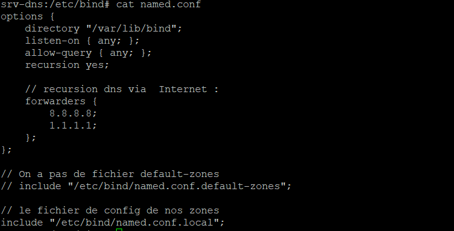
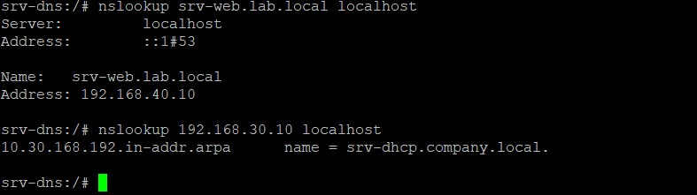
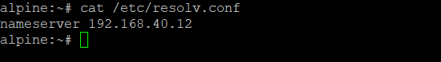
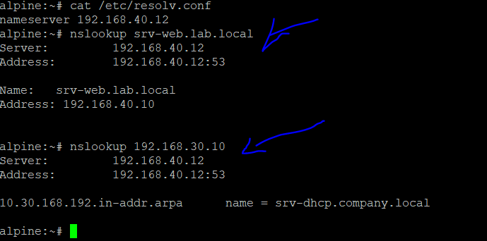

# 🌐 Configuration du DNS — BIND9

> Mise en place du service DNS avec BIND9 pour la résolution de noms en adresses IP, et inversement.



---

## 📋 Table des enregistrements DNS

| Nom FQDN | Type | Adresse IP |
|---|---|---|
| srv-dhcp.company.local | A | 192.168.30.10 |
| srv-dns.lab.local | A | 192.168.40.12 |
| srv-files.company.local | A | 192.168.30.20 |
| srv-web.lab.local | A | 192.168.40.10 |
| srv-proxy.lab.local | A | 192.168.40.11 |
| srv-ldap.company.local | A | 192.168.30.30 |
| gw-core.company.local | A | 192.168.99.1 |

---

## 1. Installation de BIND9
```sh
apk add bind bind-tools
rc-update add named default
```

---

## 2. Configuration de BIND9

Tous les fichiers de configuration se trouvent dans `/etc/bind`. Déplacez-vous dans ce dossier :
```sh
cd /etc/bind
```

### `named.conf` — Configuration principale



### `named.conf.local` — Déclaration des zones

C'est ici qu'on déclare les zones directes et inverses que BIND va gérer.

---

## 3. Fichiers de zones

### Zone directe — `db.company.local`
```dns
$TTL 86400
@   IN  SOA  ns1.company.local. admin.company.local. (
        2026033101 ; Numéro de version de la zone
        3600       ; Délai d'attente pour les serveurs esclaves (1h)
        1800       ; Délai avant nouvelle tentative en cas d'échec (30min)
        604800     ; Durée avant que la zone soit considérée obsolète (1 semaine)
        86400      ; TTL négatif — durée de mise en cache des réponses NXDOMAIN
        )

@           IN  NS      ns1.company.local.
ns1         IN  A       192.168.40.12

srv-dhcp    IN  A       192.168.30.10
srv-files   IN  A       192.168.30.20
srv-ldap    IN  A       192.168.30.30
```

### Zone directe — `db.lab.local`
```dns
$TTL 86400
@   IN  SOA  ns1.lab.local. admin.lab.local. (
        2026033101 ; Numéro de version de la zone
        3600       ; Délai d'attente pour les serveurs esclaves (1h)
        1800       ; Délai avant nouvelle tentative en cas d'échec (30min)
        604800     ; Durée avant que la zone soit considérée obsolète (1 semaine)
        86400      ; TTL négatif — durée de mise en cache des réponses NXDOMAIN
        )

@           IN  NS      ns1.lab.local.
ns1         IN  A       192.168.40.12
srv-web     IN  A       192.168.40.10
srv-dns     IN  A       192.168.40.11
```

### Zone inverse — `db.192.168.30`
```dns
$TTL 86400
@   IN  SOA  ns1.company.local. admin.company.local. (
        2026033101
        3600
        1800
        604800
        86400
        )

@   IN  NS  ns1.company.local.

10  IN  PTR  srv-dhcp.company.local.
20  IN  PTR  srv-files.company.local.
30  IN  PTR  srv-ldap.company.local.
```

### Zone inverse — `db.192.168.40`
```dns
$TTL 86400
@   IN  SOA  ns1.lab.local. admin.lab.local. (
        2026033101
        3600
        1800
        604800
        86400
        )

@   IN  NS  ns1.lab.local.

; Serveur DNS lui-même (indispensable)
12  IN  PTR  ns1.lab.local.

; Autres machines
10  IN  PTR  srv-web.lab.local.
11  IN  PTR  srv-proxy.lab.local.
```

---

## 4. Droits et permissions

Créez le dossier de données de BIND s'il n'existe pas, puis assignez les bons droits à l'utilisateur `named` :
```sh
mkdir -p /var/lib/bind

chown -R named:named /etc/bind
chown -R named:named /var/lib/bind

chmod -R 755 /etc/bind
chmod -R 775 /var/lib/bind
```

---

## 5. Validation de la configuration

Avant de démarrer le service, vérifiez qu'il n'y a pas d'erreurs de syntaxe.

**Configuration principale :**
```sh
named-checkconf /etc/bind/named.conf
```

**Zones directes :**
```sh
named-checkzone company.local /etc/bind/db.company.local
named-checkzone lab.local /etc/bind/db.lab.local
```

**Zones inverses :**
```sh
named-checkzone 30.168.192.in-addr.arpa /etc/bind/db.192.168.30
named-checkzone 40.168.192.in-addr.arpa /etc/bind/db.192.168.40
```

---

## 6. Démarrage du service
```sh
rc-service named start        # Démarrage immédiat
rc-service named status       # Vérification du statut
rc-update add named default   # Lancement automatique au démarrage
```

---

## ✅ Tests de résolution

**Résolution directe :**
```sh
nslookup srv-web.lab.local 127.0.0.1
```

**Résolution inverse :**
```sh
nslookup 192.168.40.10 127.0.0.1
```

Les deux tests fonctionnent correctement :



---

## 7. Vérification côté clients

Sur une machine utilisateur, vérifiez que le DHCP a bien transmis l'adresse du serveur DNS :
```sh
cat /etc/resolv.conf
```



Puis testez la résolution de noms depuis le client :


